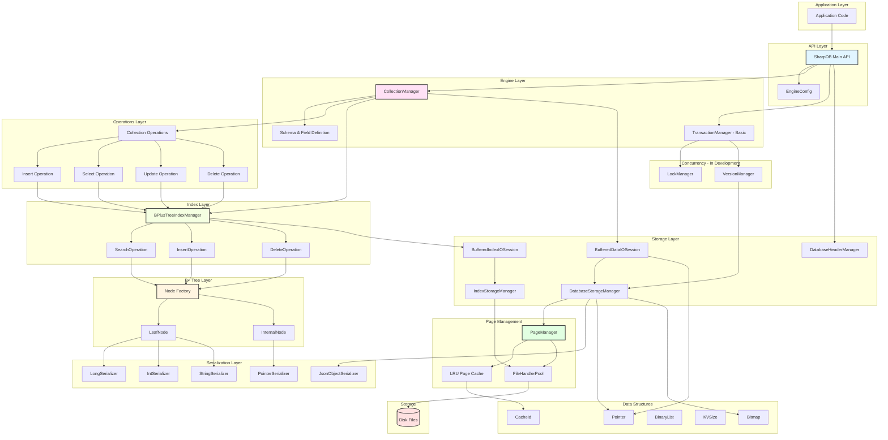

# SharpDB - Embedded Database Engine

<div align="center">

</div>

---

## 📋 Table of Contents

- [Project Description](#-project-description)
- [Supported Features](#-supported-features)
- [Architecture Overview](#-architecture-overview)
- [Quick Start](#-quick-start)
- [Code Examples](#-code-examples)
- [Project Structure](#-project-structure)
- [Contributing](#-contributing)

---

## 🎯 Project Description

**SharpDB** is an educational embedded database engine built from scratch in C#. This project demonstrates the implementation of fundamental database concepts:

- **B+ Tree Indexing**: Implementation of self-balancing tree structure for efficient data access
- **Page-Based Storage**: Fixed-size page management with file pooling
- **Collection Management**: Schema-based data organization with primary keys
- **Serialization**: Support for binary and JSON serialization
- **Transaction Foundation**: Basic transaction and lock management infrastructure

### Project Goals

1. **Educational**: Learn and demonstrate database internals and implementation patterns
2. **Experimental**: Explore different approaches to database design
3. **Foundation Building**: Create a base for future database features
4. **Documentation**: Build understanding through implementation

### Learning Objectives

- **Database Internals**: Understand how databases work under the hood
- **Data Structures**: Implement B+ Trees and other database structures
- **Storage Management**: Learn about page-based storage and caching
- **Concurrency**: Explore transaction management and locking
- **System Design**: Design modular and extensible database components

---

## ✨ Supported Features

### ✅ Implemented Features

- **B+ Tree Indexing**
    - Self-balancing tree structure
    - O(log n) search, insert, delete operations
    - Configurable tree degree
    - Leaf node implementation

- **Basic Storage**
    - Page-based storage management
    - File handler pooling
    - Binary serialization
    - JSON object serialization

- **Collection Management**
    - Create/Get collections
    - Schema definition
    - Primary key support
    - Basic CRUD operations

### 🚧 In Development

- **Transaction Support**
    - Basic transaction manager
    - Lock manager (partial)
    - Version manager (basic)

- **Index Features**
    - Range queries
    - Secondary indexes
    - Composite keys

### 📋 Planned Features

- **ACID Compliance**
    - Full transaction rollback
    - Crash recovery
    - Write-ahead logging

- **MVCC (Multi-Version Concurrency Control)**
    - Non-blocking reads
    - Snapshot isolation
    - Version chain management

- **Advanced Querying**
    - SQL-like query language
    - Query optimization
    - Join operations

### Storage Features

- ✅ **Page-Based Storage**
    - Fixed-size pages (configurable, default 4KB)
    - Page allocation and recycling
    - LRU cache implementation

- ✅ **Flexible Serialization**
    - Binary serialization for performance
    - JSON serialization for flexibility
    - Primitive type serializers (long, int, string)

---

## 🏗️ Architecture Overview

### High-Level Architecture



### Architecture Description

#### **1. API Layer**
- **SharpDB**: Main entry point providing database operations
- **EngineConfig**: Configuration for page size, B+ tree degree, file handles

#### **2. Engine Layer**
- **CollectionManager**: Manages collections with schema-based organization
- **Schema & Field**: Define data structure and field types
- **TransactionManager**: Basic transaction support (in development)

#### **3. Operations Layer**
- CRUD operations: Insert, Select, Update, Delete
- Coordinates between collections and indexes

#### **4. Index Layer**
- **BPlusTreeIndexManager**: Manages B+ Tree indexes
- **Operations**: Search, Insert, Delete on B+ Tree
- **Sessions**: Buffered I/O for index operations

#### **5. B+ Tree Layer**
- **Node Factory**: Creates and manages tree nodes
- **LeafNode**: Stores actual data with key-value pairs
- **InternalNode**: Routes to child nodes

#### **6. Serialization Layer**
- **Object Serializers**: JSON serialization for complex objects
- **Primitive Serializers**: Binary serialization for long, int, string
- **PointerSerializer**: Serializes storage pointers

#### **7. Storage Layer**
- **DatabaseStorageManager**: Manages data record storage
- **IndexStorageManager**: Manages index node storage
- **DatabaseHeaderManager**: Manages collection metadata
- **I/O Sessions**: Buffered read/write operations

#### **8. Page Management**
- **PageManager**: Allocates and recycles fixed-size pages
- **LRU Cache**: Caches frequently accessed pages
- **FileHandlerPool**: Reuses file handles for efficiency

#### **9. Data Structures**
- **Pointer**: References to storage locations
- **Bitmap**: Tracks null values
- **BinaryList**: Dynamic binary data list
- **LRU Cache**: Implements cache eviction policy

#### **10. Concurrency (In Development)**
- **LockManager**: Manages locks (partial implementation)
- **VersionManager**: Handles data versions (basic implementation)


---

## 🚀 Quick Start

### Prerequisites

- [.NET 9.0 SDK](https://dotnet.microsoft.com/download/dotnet/9.0)

### Installation

```bash
# Clone the repository
git clone https://github.com/yourusername/sharpdb.git
cd SharpDB

# Build the project
dotnet build
```

### Basic Usage

```csharp
using SharpDB;
using SharpDB.Engine;
using SharpDB.Configuration;

// Initialize database
var db = new SharpDB("./mydb");

// Define schema
var schema = new Schema
{
    Version = 1,
    Fields = new List<Field>
    {
        new Field { Name = "Id", Type = FieldType.Long, IsPrimaryKey = true },
        new Field { Name = "Name", Type = FieldType.String },
        new Field { Name = "Age", Type = FieldType.Integer }
    }
};

// Create collection
var users = await db.CreateCollectionAsync<User, long>(
    "Users", 
    schema, 
    keyExtractor: u => u.Id);

// Insert data
await users.InsertAsync(new User 
{ 
    Id = 1, 
    Name = "Alice", 
    Age = 30 
});

// Query data
var user = await users.SelectAsync(1L);
Console.WriteLine($"Found: {user?.Name}, Age: {user?.Age}");

// Cleanup
db.Dispose();
```

---

## 💻 Code Examples

### Example 1: CRUD Operations

```csharp
// CREATE
var newUser = new User { Id = 1, Name = "John Doe", Age = 25 };
await users.InsertAsync(newUser);

// READ
var user = await users.SelectAsync(1L);
Console.WriteLine($"User: {user.Name}");

// UPDATE
user.Age = 26;
await users.UpdateAsync(user);

// DELETE
bool deleted = await users.DeleteAsync(1L);
```

### Example 2: Working with Collections

```csharp
// Create multiple collections
var products = await db.CreateCollectionAsync<Product, long>(
    "Products",
    productSchema,
    keyExtractor: p => p.Id);

var orders = await db.CreateCollectionAsync<Order, long>(
    "Orders",
    orderSchema,
    keyExtractor: o => o.Id);

// Retrieve existing collection
var existingUsers = await db.GetCollectionAsync<User, long>(
    "Users",
    keyExtractor: u => u.Id);
```

### Example 3: Configuration Options

```csharp
// Custom configuration
var config = new EngineConfig
{
    PageSize = 8192,          // 8KB pages for larger records
    BTreeDegree = 256,        // Higher degree for fewer tree levels
    MaxFileHandles = 200      // More file handles for concurrent access
};

var db = new SharpDB("./mydb", config);
```

### Example 4: Error Handling

```csharp
try
{
    // Try to insert
    await users.InsertAsync(new User { Id = 1, Name = "Alice" });
}
catch (InvalidOperationException ex)
{
    Console.WriteLine($"Operation failed: {ex.Message}");
}
catch (Exception ex)
{
    Console.WriteLine($"Unexpected error: {ex.Message}");
}
finally
{
    // Ensure cleanup
    await db.FlushAsync();
}
```

---


### Configuration

Create an `EngineConfig` to customize behavior:

```csharp
var config = new EngineConfig
{
    PageSize = 4096,              // 4KB pages
    BTreeDegree = 128,            // B+ tree node capacity
    MaxFileHandles = 100          // File handle pool size
};

var db = new SharpDB("./mydb", config);
```

---

## 📁 Project Structure

```
SharpDB/
├── SharpDB/                        # Main project
│   ├── Core/                      # Core abstractions and interfaces
│   │   ├── Abstractions/          # Interfaces for all components
│   │   │   ├── Concurrency/       # Transaction & Lock interfaces
│   │   │   ├── Index/             # Index interfaces
│   │   │   ├── Operations/        # Operation interfaces
│   │   │   ├── Serialization/     # Serialization interfaces
│   │   │   ├── Sessions/          # IO Session interfaces
│   │   │   └── Storage/           # Storage interfaces
│   │   ├── Constants/             # System constants
│   │   └── Exceptions/            # Custom exceptions
│   │
│   ├── DataStructures/            # Core data structures
│   │   ├── BinaryList.cs          # Binary list implementation
│   │   ├── Bitmap.cs              # Bitmap for null tracking
│   │   ├── CacheId.cs             # Cache identifier
│   │   ├── KVSize.cs              # Key-Value size structure
│   │   ├── LruCache.cs            # LRU cache implementation
│   │   └── Pointer.cs             # Storage pointer
│   │
│   ├── Engine/                    # Database engine core
│   │   ├── CollectionManager.cs   # Collection management
│   │   ├── Field.cs               # Field definition
│   │   ├── Schema.cs              # Schema definition
│   │   ├── Concurrency/           # Concurrency control
│   │   └── Transaction/           # Transaction management
│   │
│   ├── Index/                     # Indexing implementation
│   │   ├── BinaryObject/          # Binary serialization
│   │   ├── Manager/               # Index managers (BPlusTreeIndexManager)
│   │   ├── Node/                  # B+ Tree nodes
│   │   ├── Operations/            # Index operations
│   │   └── Session/               # Index IO sessions
│   │
│   ├── Operations/                # CRUD operations
│   │   └── Collection operations
│   │
│   ├── Serialization/             # Serialization layer
│   │   ├── Object serializers
│   │   └── Primitive type serializers
│   │
│   ├── Storage/                   # Storage management
│   │   ├── Database/              # Database storage
│   │   ├── FilePool/              # File handler pooling
│   │   ├── Header/                # Database headers
│   │   ├── Index/                 # Index storage
│   │   ├── Page/                  # Page management
│   │   └── Sessions/              # Storage sessions
│   │
│   ├── Configuration/             # Configuration
│   │   └── EngineConfig.cs        # Engine configuration
│   │
│   ├── SharpDB.cs                 # Main API entry point
│   └── Program.cs                 # Entry point
│
├── SharpDB.Test/                  # Unit tests
│   ├── DataStructures/            # Data structure tests
│   │   └── PointerTest.cs
│   └── UnitTest1.cs
│
├── .gitignore
├── README.md                      # This file
└── SharpDB.sln                    # Solution file
```

---


## 🤝 Contributing

Contributions are welcome! This is a learning project, so feel free to experiment and suggest improvements.

### Building from Source

```bash
# Fork and clone
git clone https://github.com/yourusername/sharpdb.git
cd SharpDB

# Create feature branch
git checkout -b feature/my-feature

# Make changes and test
dotnet test

# Submit PR
git push origin feature/my-feature
```

---


## 🙏 Acknowledgments

- Inspired by database systems: SQLite, LevelDB, and RocksDB
- B+ Tree algorithms based on academic research
- Storage design influenced by traditional RDBMS architectures

---


<div align="center">

⭐ Star us on GitHub if you find this project useful!

</div>
