# SharpDB Architecture Diagrams

> **12 foundational diagrams** (C4, write/read paths, B+Tree, MVCC, WAL, isolation) followed by
> **13 deep-dive diagrams** (lock manager, B+Tree mutations, deferred flush, group commit, vacuum GC,
> serialization compiler, secondary index sync, sequence allocation, page buffer pool, file layout,
> query / range-scan, backup, component class map).

## 1. System Context (C4 Level 1)

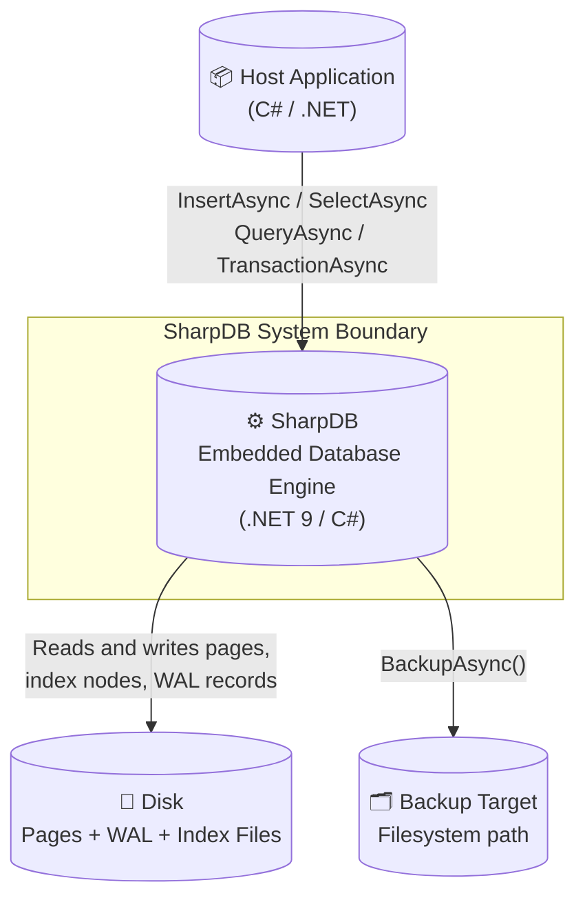
```mermaid
flowchart TB
    subgraph boundary[SharpDB System Boundary]
        DB[("⚙️ SharpDB\nEmbedded Database Engine\n(.NET 9 / C#)")]
    end

    APP[("📦 Host Application\n(C# / .NET)")]
    DISK[("💾 Disk\nPages + WAL + Index Files")]
    BACKUP[("🗂️ Backup Target\nFilesystem path")]

    APP -->|"InsertAsync / SelectAsync\nQueryAsync / TransactionAsync"| DB
    DB -->|"Reads and writes pages,\nindex nodes, WAL records"| DISK
    DB -->|"BackupAsync()"| BACKUP
```

---

## 2. Container Diagram (C4 Level 2)

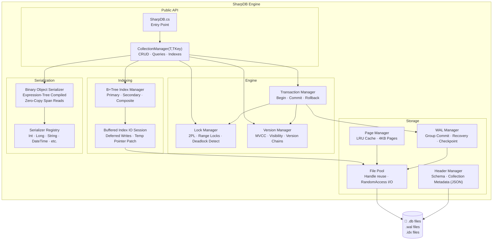
```mermaid
flowchart TB
    subgraph sharpdb[SharpDB Engine]
        direction TB

        subgraph api[Public API]
            MAIN["SharpDB.cs\nEntry Point"]
            CM["CollectionManager(T,TKey)\nCRUD · Queries · Indexes"]
        end

        subgraph engine[Engine]
            TXN["Transaction Manager\nBegin · Commit · Rollback"]
            LOCK["Lock Manager\n2PL · Range Locks · Deadlock Detect"]
            VER["Version Manager\nMVCC · Visibility · Version Chains"]
        end

        subgraph storage[Storage]
            PAGE["Page Manager\nLRU Cache · 4KB Pages"]
            WAL["WAL Manager\nGroup Commit · Recovery · Checkpoint"]
            HDR["Header Manager\nSchema · Collection Metadata (JSON)"]
            FP["File Pool\nHandle reuse · RandomAccess I/O"]
        end

        subgraph index[Indexing]
            BPTREE["B+Tree Index Manager\nPrimary · Secondary · Composite"]
            BUFIDX["Buffered Index IO Session\nDeferred Writes · Temp Pointer Patch"]
        end

        subgraph serial[Serialization]
            SER["Binary Object Serializer\nExpression-Tree Compiled\nZero-Copy Span Reads"]
            REG["Serializer Registry\nInt · Long · String · DateTime · etc."]
        end
    end

    DISK[("💾 .db files\n.wal files\n.idx files")]

    MAIN --> CM
    CM --> TXN
    CM --> LOCK
    CM --> VER
    CM --> BPTREE
    TXN --> WAL
    TXN --> VER
    TXN --> LOCK
    BPTREE --> BUFIDX
    BUFIDX --> FP
    PAGE --> FP
    WAL --> FP
    CM --> SER
    SER --> REG
    FP --> DISK
    HDR --> DISK
```

---

## 3. Component Diagram — Engine Layer (C4 Level 3)

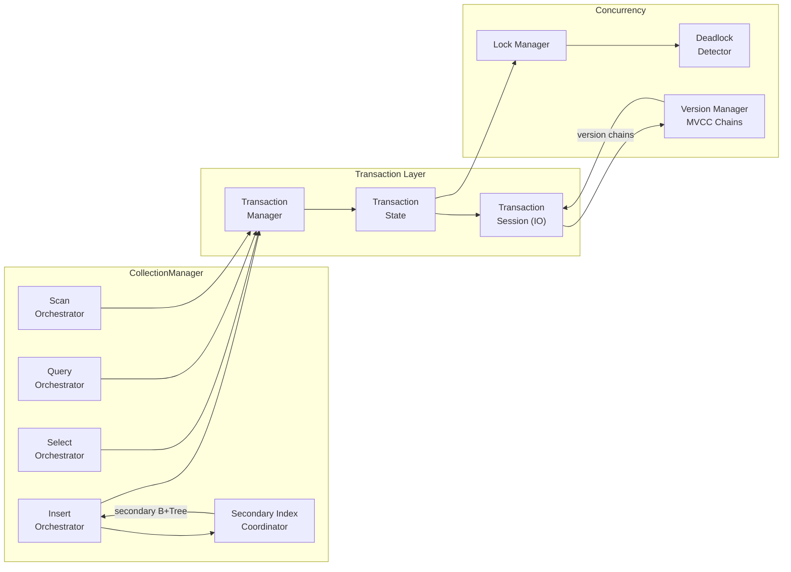
```mermaid
flowchart LR
    subgraph colmgr[CollectionManager]
        direction TB
        INSERT["Insert\nOrchestrator"]
        SELECT["Select\nOrchestrator"]
        QUERY["Query\nOrchestrator"]
        SCAN["Scan\nOrchestrator"]
        SIDX["Secondary Index\nCoordinator"]
    end

    subgraph txnlayer[Transaction Layer]
        TM["Transaction\nManager"]
        TX["Transaction\nState"]
        TS["Transaction\nSession (IO)"]
    end

    subgraph concurrency[Concurrency]
        LM["Lock Manager"]
        DD["Deadlock\nDetector"]
        VM["Version Manager\nMVCC Chains"]
    end

    INSERT --> TM
    SELECT --> TM
    QUERY --> TM
    SCAN --> TM
    TM --> TX
    TX --> TS
    TX --> LM
    LM --> DD
    TS --> VM
    VM -->|version chains| TS
    INSERT --> SIDX
    SIDX -->|secondary B+Tree| INSERT
```

---

## 4. Write Path — Sequence Diagram

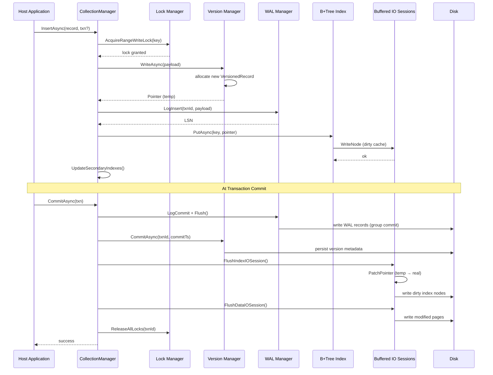
```mermaid
sequenceDiagram
    participant App as Host Application
    participant CM as CollectionManager
    participant LM as Lock Manager
    participant VM as Version Manager
    participant WAL as WAL Manager
    participant IDX as B+Tree Index
    participant BUF as Buffered IO Sessions
    participant DISK as Disk

    App->>CM: InsertAsync(record, txn?)
    CM->>LM: AcquireRangeWriteLock(key)
    LM-->>CM: lock granted

    CM->>VM: WriteAsync(payload)
    VM->>VM: allocate new VersionedRecord
    VM-->>CM: Pointer (temp)

    CM->>WAL: LogInsert(txnId, payload)
    WAL-->>CM: LSN

    CM->>IDX: PutAsync(key, pointer)
    IDX->>BUF: WriteNode (dirty cache)
    BUF-->>IDX: ok

    CM->>CM: UpdateSecondaryIndexes()

    Note over App,DISK: At Transaction Commit

    App->>CM: CommitAsync(txn)
    CM->>WAL: LogCommit + Flush()
    WAL->>DISK: write WAL records (group commit)
    CM->>VM: CommitAsync(txnId, commitTs)
    VM->>DISK: persist version metadata
    CM->>BUF: FlushIndexIOSession()
    BUF->>BUF: PatchPointer (temp → real)
    BUF->>DISK: write dirty index nodes
    CM->>BUF: FlushDataIOSession()
    BUF->>DISK: write modified pages
    CM->>LM: ReleaseAllLocks(txnId)
    CM-->>App: success
```

---

## 5. Read Path — Sequence Diagram

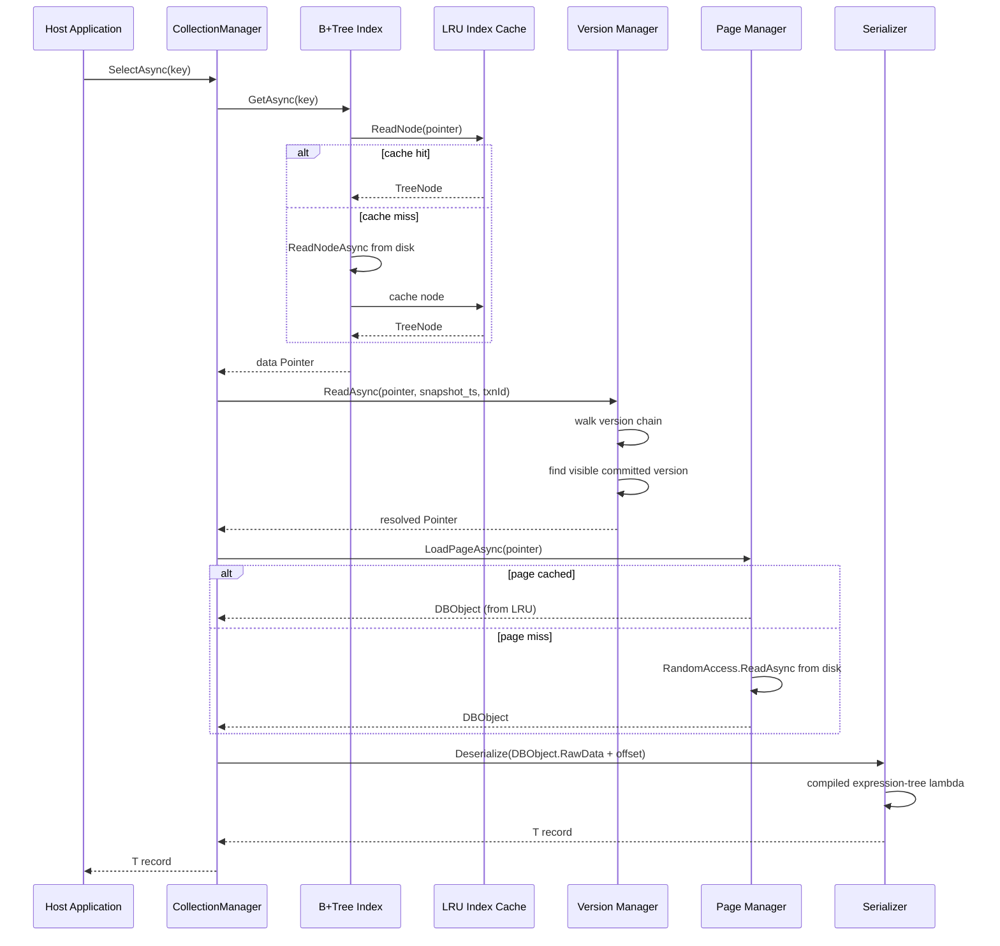
```mermaid
sequenceDiagram
    participant App as Host Application
    participant CM as CollectionManager
    participant IDX as B+Tree Index
    participant LRU as LRU Index Cache
    participant VM as Version Manager
    participant PAGE as Page Manager
    participant SER as Serializer

    App->>CM: SelectAsync(key)
    CM->>IDX: GetAsync(key)
    IDX->>LRU: ReadNode(pointer)

    alt cache hit
        LRU-->>IDX: TreeNode
    else cache miss
        IDX->>IDX: ReadNodeAsync from disk
        IDX->>LRU: cache node
        LRU-->>IDX: TreeNode
    end

    IDX-->>CM: data Pointer

    CM->>VM: ReadAsync(pointer, snapshot_ts, txnId)
    VM->>VM: walk version chain
    VM->>VM: find visible committed version
    VM-->>CM: resolved Pointer

    CM->>PAGE: LoadPageAsync(pointer)

    alt page cached
        PAGE-->>CM: DBObject (from LRU)
    else page miss
        PAGE->>PAGE: RandomAccess.ReadAsync from disk
        PAGE-->>CM: DBObject
    end

    CM->>SER: Deserialize(DBObject.RawData + offset)
    SER->>SER: compiled expression-tree lambda
    SER-->>CM: T record

    CM-->>App: T record
```

---

## 6. Transaction Lifecycle — State Diagram

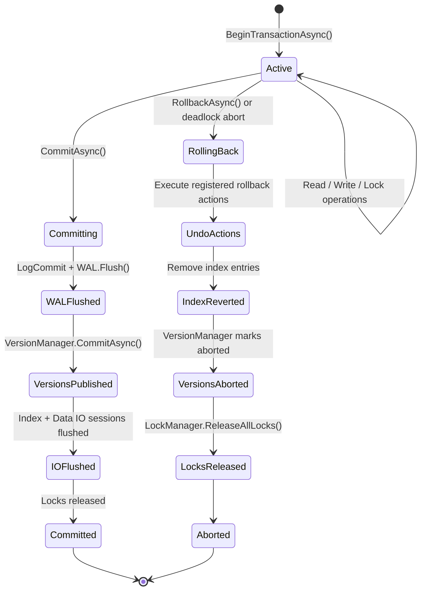
```mermaid
stateDiagram-v2
    [*] --> Active : BeginTransactionAsync()

    Active --> Active : Read / Write / Lock operations

    Active --> Committing : CommitAsync()
    Active --> RollingBack : RollbackAsync() or deadlock abort

    Committing --> WALFlushed : LogCommit + WAL.Flush()
    WALFlushed --> VersionsPublished : VersionManager.CommitAsync()
    VersionsPublished --> IOFlushed : Index + Data IO sessions flushed
    IOFlushed --> Committed : Locks released
    Committed --> [*]

    RollingBack --> UndoActions : Execute registered rollback actions
    UndoActions --> IndexReverted : Remove index entries
    IndexReverted --> VersionsAborted : VersionManager marks aborted
    VersionsAborted --> LocksReleased : LockManager.ReleaseAllLocks()
    LocksReleased --> Aborted
    Aborted --> [*]
```

---

## 7. B+Tree Structure — Flowchart

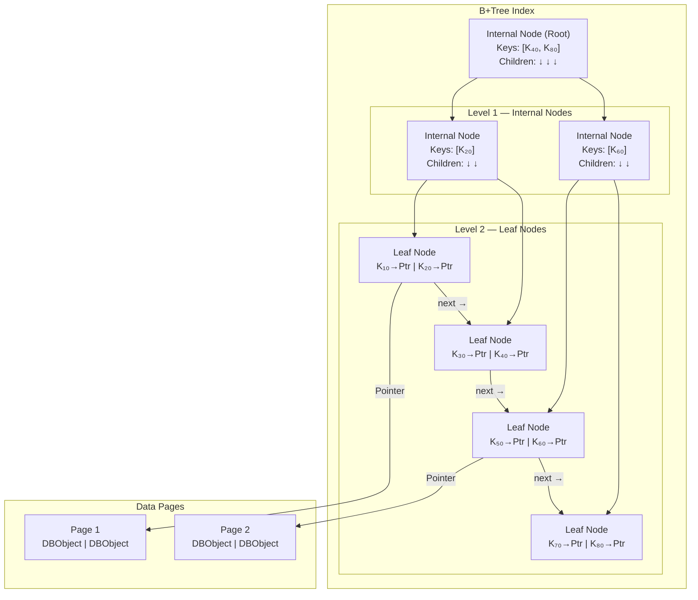
```mermaid
flowchart TB
    subgraph bptree[B+Tree Index]
        direction TB
        ROOT["Internal Node (Root)\nKeys: [K₄₀, K₈₀]\nChildren: ↓ ↓ ↓"]

        subgraph l1[Level 1 — Internal Nodes]
            N1["Internal Node\nKeys: [K₂₀]\nChildren: ↓ ↓"]
            N2["Internal Node\nKeys: [K₆₀]\nChildren: ↓ ↓"]
        end

        subgraph l2[Level 2 — Leaf Nodes]
            L1["Leaf Node\nK₁₀→Ptr | K₂₀→Ptr"]
            L2["Leaf Node\nK₃₀→Ptr | K₄₀→Ptr"]
            L3["Leaf Node\nK₅₀→Ptr | K₆₀→Ptr"]
            L4["Leaf Node\nK₇₀→Ptr | K₈₀→Ptr"]
        end

        ROOT --> N1
        ROOT --> N2
        N1 --> L1
        N1 --> L2
        N2 --> L3
        N2 --> L4
        L1 -->|"next →"| L2
        L2 -->|"next →"| L3
        L3 -->|"next →"| L4
    end

    subgraph pages[Data Pages]
        P1["Page 1\nDBObject | DBObject"]
        P2["Page 2\nDBObject | DBObject"]
    end

    L1 -->|Pointer| P1
    L3 -->|Pointer| P2
```

---

## 8. MVCC Version Chain

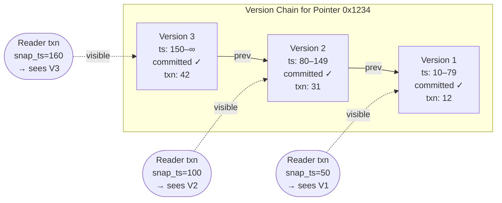
```mermaid
flowchart LR
    subgraph chain[Version Chain for Pointer 0x1234]
        direction LR
        V3["Version 3\nts: 150–∞\ncommitted ✓\ntxn: 42"]
        V2["Version 2\nts: 80–149\ncommitted ✓\ntxn: 31"]
        V1["Version 1\nts: 10–79\ncommitted ✓\ntxn: 12"]
    end

    V3 -->|prev| V2
    V2 -->|prev| V1

    T1(["Reader txn\nsnap_ts=100\n→ sees V2"])
    T2(["Reader txn\nsnap_ts=160\n→ sees V3"])
    T3(["Reader txn\nsnap_ts=50\n→ sees V1"])

    T1 -.->|visible| V2
    T2 -.->|visible| V3
    T3 -.->|visible| V1
```

---

## 9. Page Layout — ER Diagram

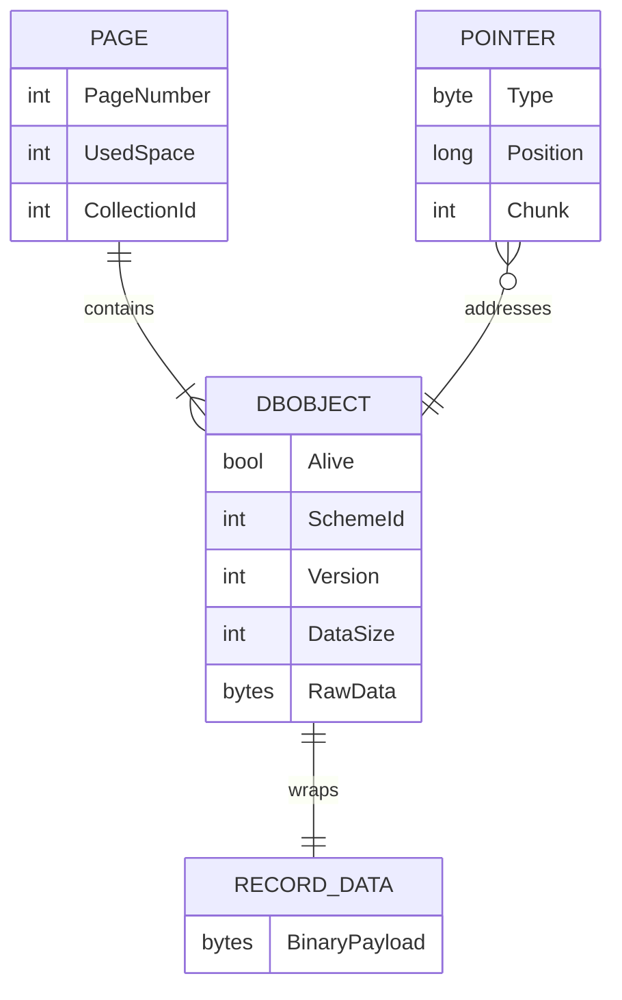
```mermaid
erDiagram
    PAGE ||--|{ DBOBJECT : contains
    DBOBJECT ||--|| RECORD_DATA : wraps

    PAGE {
        int PageNumber
        int UsedSpace
        int CollectionId
    }

    DBOBJECT {
        bool Alive
        int SchemeId
        int Version
        int DataSize
        bytes RawData
    }

    RECORD_DATA {
        bytes BinaryPayload
    }

    POINTER }o--|| DBOBJECT : addresses
    POINTER {
        byte Type
        long Position
        int Chunk
    }
```

---

## 10. Key Data Structures — Class Diagram

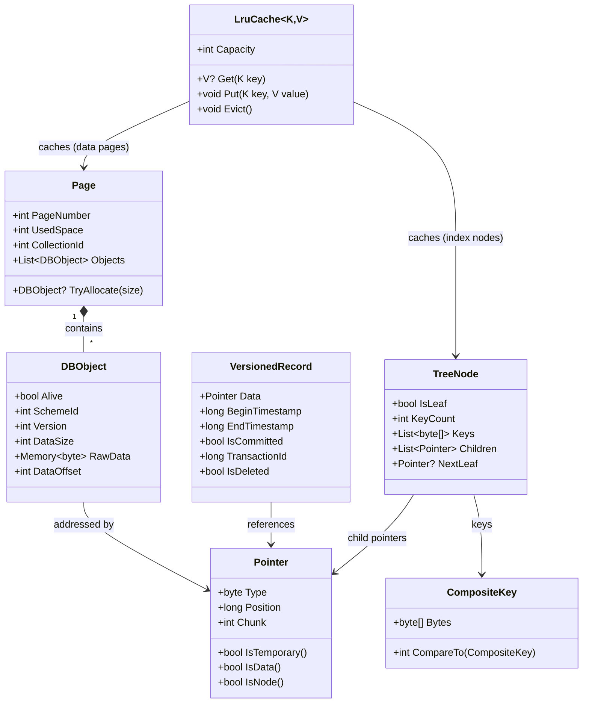
```mermaid
classDiagram
    class Pointer {
        +byte Type
        +long Position
        +int Chunk
        +bool IsTemporary()
        +bool IsData()
        +bool IsNode()
    }

    class DBObject {
        +bool Alive
        +int SchemeId
        +int Version
        +int DataSize
        +Memory~byte~ RawData
        +int DataOffset
    }

    class Page {
        +int PageNumber
        +int UsedSpace
        +int CollectionId
        +List~DBObject~ Objects
        +DBObject? TryAllocate(size)
    }

    class VersionedRecord {
        +Pointer Data
        +long BeginTimestamp
        +long EndTimestamp
        +bool IsCommitted
        +long TransactionId
        +bool IsDeleted
    }

    class TreeNode {
        +bool IsLeaf
        +int KeyCount
        +List~byte[]~ Keys
        +List~Pointer~ Children
        +Pointer? NextLeaf
    }

    class CompositeKey {
        +byte[] Bytes
        +int CompareTo(CompositeKey)
    }

    class LruCache~K,V~ {
        +int Capacity
        +V? Get(K key)
        +void Put(K key, V value)
        +void Evict()
    }

    Page "1" *-- "*" DBObject : contains
    DBObject --> Pointer : addressed by
    VersionedRecord --> Pointer : references
    TreeNode --> Pointer : child pointers
    TreeNode --> CompositeKey : keys
    LruCache --> TreeNode : caches (index nodes)
    LruCache --> Page : caches (data pages)
```

---

## 11. WAL Recovery — Flowchart

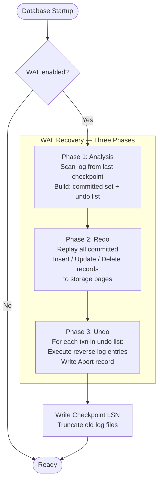
```mermaid
flowchart TD
    START([Database Startup]) --> CHECK{WAL enabled?}
    CHECK -->|No| READY([Ready])
    CHECK -->|Yes| ANALYSIS

    subgraph recovery[WAL Recovery — Three Phases]
        ANALYSIS["Phase 1: Analysis\nScan log from last checkpoint\nBuild: committed set + undo list"]
        REDO["Phase 2: Redo\nReplay all committed\nInsert / Update / Delete records\nto storage pages"]
        UNDO["Phase 3: Undo\nFor each txn in undo list:\nExecute reverse log entries\nWrite Abort record"]
    end

    ANALYSIS --> REDO --> UNDO

    UNDO --> CHECKPOINT["Write Checkpoint LSN\nTruncate old log files"]
    CHECKPOINT --> READY
```

---

## 12. Isolation Levels — Decision Flowchart

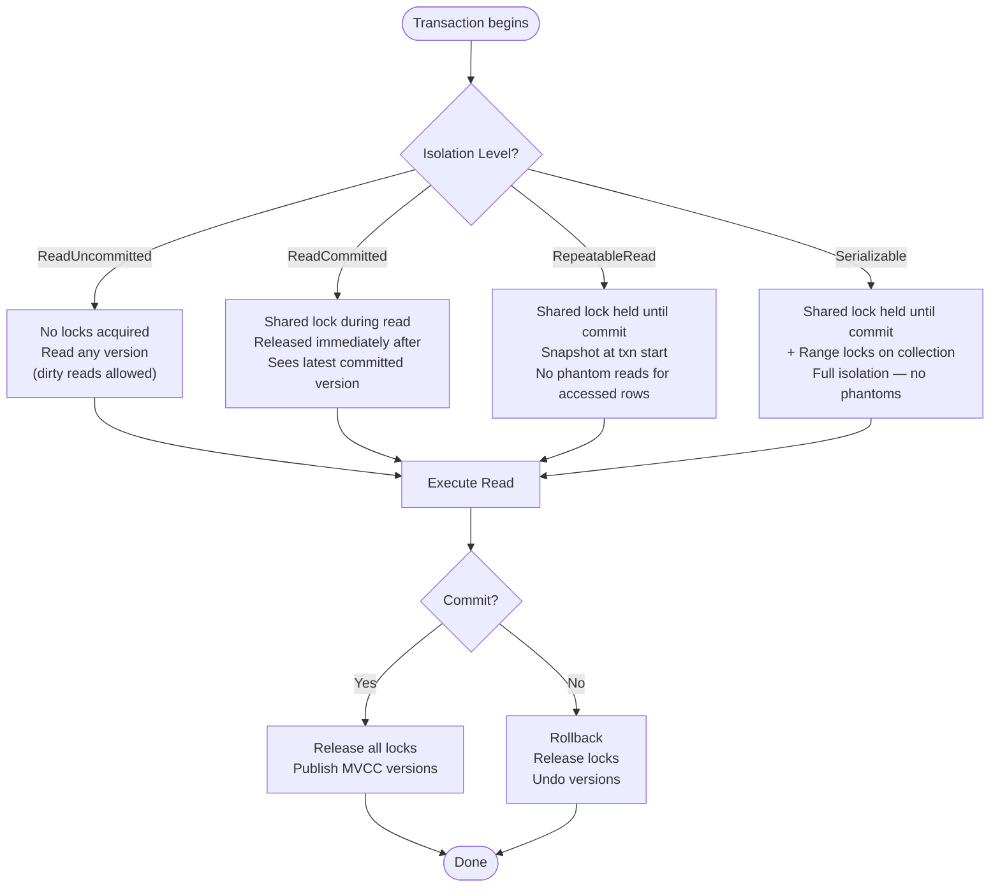
```mermaid
flowchart TD
    START([Transaction begins]) --> IL{Isolation Level?}

    IL -->|ReadUncommitted| RU["No locks acquired\nRead any version\n(dirty reads allowed)"]
    IL -->|ReadCommitted| RC["Shared lock during read\nReleased immediately after\nSees latest committed version"]
    IL -->|RepeatableRead| RR["Shared lock held until commit\nSnapshot at txn start\nNo phantom reads for accessed rows"]
    IL -->|Serializable| SER["Shared lock held until commit\n+ Range locks on collection\nFull isolation — no phantoms"]

    RU --> EXEC[Execute Read]
    RC --> EXEC
    RR --> EXEC
    SER --> EXEC

    EXEC --> COMMIT{Commit?}
    COMMIT -->|Yes| REL[Release all locks\nPublish MVCC versions]
    COMMIT -->|No| ROLL[Rollback\nRelease locks\nUndo versions]
    REL --> DONE([Done])
    ROLL --> DONE
```

---

---

# Deep-Dive Diagrams

---

## 13. Lock Manager — 2PL Acquisition & Deadlock Detection

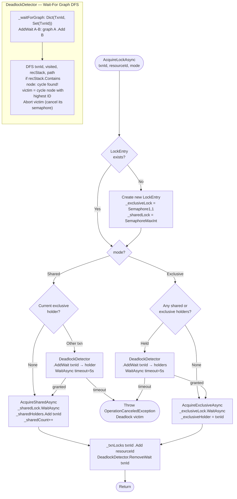
```mermaid
flowchart TD
    START([AcquireLockAsync\ntxnId, resourceId, mode]) --> ENTRY{LockEntry\nexists?}
    ENTRY -->|No| CREATE[Create new LockEntry\n_exclusiveLock = Semaphore1,1\n_sharedLock = SemaphoreMaxInt]
    ENTRY -->|Yes| CHECK{mode?}
    CREATE --> CHECK

    CHECK -->|Shared| SH_CHECK{Current exclusive\nholder?}
    CHECK -->|Exclusive| EX_CHECK{Any shared or\nexclusive holders?}

    SH_CHECK -->|None| SH_ACQ[AcquireSharedAsync\n_sharedLock.WaitAsync\n_sharedHolders.Add txnId\n_sharedCount++]
    SH_CHECK -->|Other txn| WAIT_SH[DeadlockDetector\n.AddWait txnId → holder\nWaitAsync timeout=5s]
    WAIT_SH -->|timeout| ABORT([Throw OperationCanceledException\nDeadlock victim])
    WAIT_SH -->|granted| SH_ACQ

    EX_CHECK -->|None| EX_ACQ[AcquireExclusiveAsync\n_exclusiveLock.WaitAsync\n_exclusiveHolder = txnId]
    EX_CHECK -->|Held| WAIT_EX[DeadlockDetector\n.AddWait txnId → holders\nWaitAsync timeout=5s]
    WAIT_EX -->|timeout| ABORT
    WAIT_EX -->|granted| EX_ACQ

    SH_ACQ --> TRACK[_txnLocks txnId .Add resourceId\nDeadlockDetector.RemoveWait txnId]
    EX_ACQ --> TRACK
    TRACK --> DONE([Return])

    subgraph deadlock[DeadlockDetector — Wait-For Graph DFS]
        direction TB
        WFG["_waitForGraph: Dict(TxnId, Set(TxnId))\nAddWait A-B: graph A .Add B"]
        DFS["DFS txnId, visited, recStack, path\n  if recStack.Contains node: cycle found!\n  victim = cycle node with highest ID\n  Abort victim (cancel its semaphore)"]
        WFG --> DFS
    end
```

---

## 14. B+Tree Insert — Split Propagation

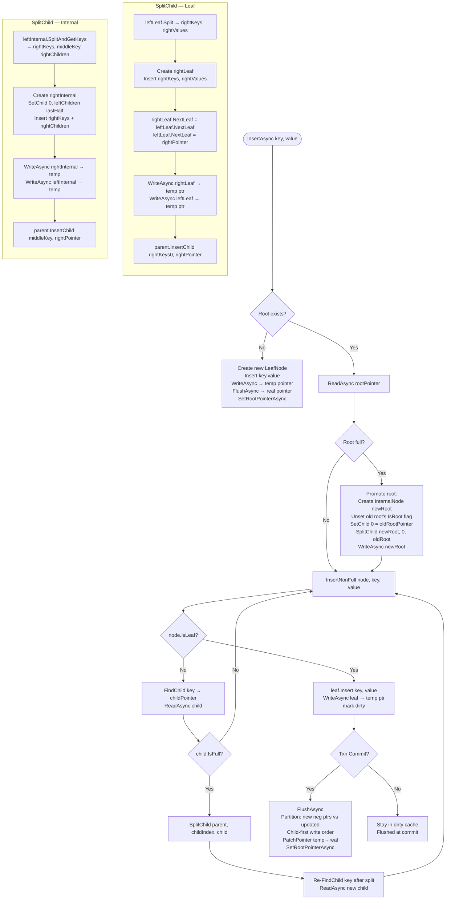
```mermaid
flowchart TD
    START([InsertAsync key, value]) --> ROOT{Root exists?}

    ROOT -->|No| NEW_ROOT[Create new LeafNode\nInsert key,value\nWriteAsync → temp pointer\nFlushAsync → real pointer\nSetRootPointerAsync]
    ROOT -->|Yes| LOAD_ROOT[ReadAsync rootPointer]

    LOAD_ROOT --> FULL{Root full?}
    FULL -->|Yes| PROMOTE[Promote root:\nCreate InternalNode newRoot\nUnset old root's IsRoot flag\nSetChild 0 = oldRootPointer\nSplitChild newRoot, 0, oldRoot\nWriteAsync newRoot]
    FULL -->|No| INSERT_NF

    PROMOTE --> INSERT_NF[InsertNonFull node, key, value]

    INSERT_NF --> LEAF{node.IsLeaf?}
    LEAF -->|Yes| LEAF_INSERT[leaf.Insert key, value\nWriteAsync leaf → temp ptr\nmark dirty]
    LEAF -->|No| FIND_CHILD[FindChild key → childPointer\nReadAsync child]

    FIND_CHILD --> CHILD_FULL{child.IsFull?}
    CHILD_FULL -->|Yes| SPLIT[SplitChild parent, childIndex, child]

    subgraph split[SplitChild — Leaf]
        direction TB
        S1[leftLeaf.Split → rightKeys, rightValues]
        S2[Create rightLeaf\nInsert rightKeys, rightValues]
        S3[rightLeaf.NextLeaf = leftLeaf.NextLeaf\nleftLeaf.NextLeaf = rightPointer]
        S4[WriteAsync rightLeaf → temp ptr\nWriteAsync leftLeaf → temp ptr]
        S5[parent.InsertChild rightKeys0, rightPointer]
        S1 --> S2 --> S3 --> S4 --> S5
    end

    subgraph split_int[SplitChild — Internal]
        direction TB
        I1[leftInternal.SplitAndGetKeys\n→ rightKeys, middleKey, rightChildren]
        I2[Create rightInternal\nSetChild 0, leftChildren lastHalf\nInsert rightKeys + rightChildren]
        I3[WriteAsync rightInternal → temp\nWriteAsync leftInternal → temp]
        I4[parent.InsertChild middleKey, rightPointer]
        I1 --> I2 --> I3 --> I4
    end

    SPLIT --> RE_FIND[Re-FindChild key after split\nReadAsync new child]
    RE_FIND --> INSERT_NF

    CHILD_FULL -->|No| INSERT_NF

    LEAF_INSERT --> COMMIT{Txn Commit?}
    COMMIT -->|Yes| FLUSH[FlushAsync\nPartition: new neg ptrs vs updated\nChild-first write order\nPatchPointer temp→real\nSetRootPointerAsync]
    COMMIT -->|No| DIRTY[Stay in dirty cache\nFlushed at commit]
```

---

## 15. B+Tree Delete — Rebalance Cascade

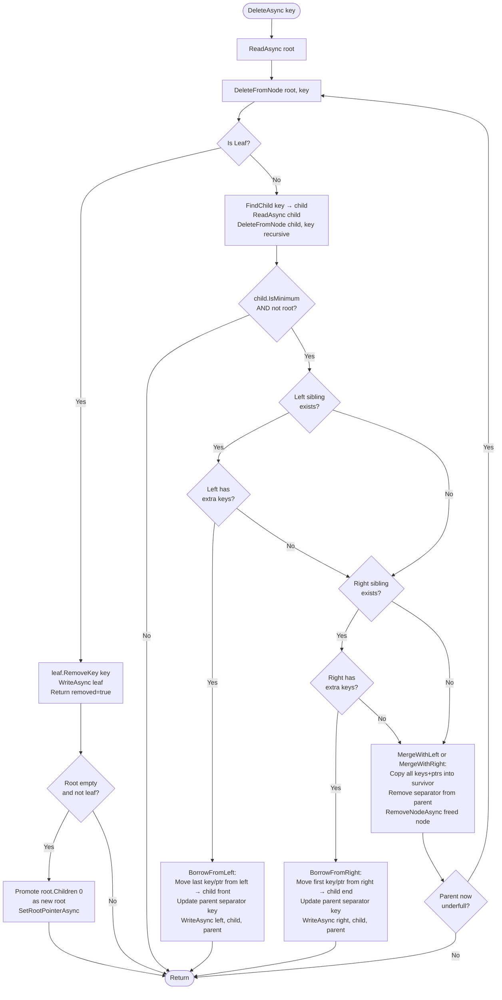
```mermaid
flowchart TD
    START([DeleteAsync key]) --> ROOT_LOAD[ReadAsync root]
    ROOT_LOAD --> DEL[DeleteFromNode root, key]

    DEL --> LEAF_Q{Is Leaf?}

    LEAF_Q -->|Yes| REMOVE[leaf.RemoveKey key\nWriteAsync leaf\nReturn removed=true]

    LEAF_Q -->|No| FIND[FindChild key → child\nReadAsync child\nDeleteFromNode child, key recursive]

    FIND --> MIN{child.IsMinimum\nAND not root?}

    MIN -->|No| DONE_R([Return])

    MIN -->|Yes| TRY_BL{Left sibling\nexists?}
    TRY_BL -->|Yes| BORROW_L{Left has\nextra keys?}
    BORROW_L -->|Yes| DO_BL[BorrowFromLeft:\nMove last key/ptr from left → child front\nUpdate parent separator key\nWriteAsync left, child, parent]
    BORROW_L -->|No| TRY_BR{Right sibling\nexists?}

    TRY_BL -->|No| TRY_BR
    TRY_BR -->|Yes| BORROW_R{Right has\nextra keys?}
    BORROW_R -->|Yes| DO_BR[BorrowFromRight:\nMove first key/ptr from right → child end\nUpdate parent separator key\nWriteAsync right, child, parent]
    BORROW_R -->|No| MERGE_L

    TRY_BR -->|No| MERGE_L

    MERGE_L[MergeWithLeft or MergeWithRight:\nCopy all keys+ptrs into survivor\nRemove separator from parent\nRemoveNodeAsync freed node]

    DO_BL --> DONE_R
    DO_BR --> DONE_R
    MERGE_L --> PARENT_MIN{Parent now\nunderfull?}
    PARENT_MIN -->|Yes| DEL
    PARENT_MIN -->|No| DONE_R

    REMOVE --> ROOT_EMPTY{Root empty\nand not leaf?}
    ROOT_EMPTY -->|Yes| PROMOTE[Promote root.Children 0\nas new root\nSetRootPointerAsync]
    ROOT_EMPTY -->|No| DONE_R
    PROMOTE --> DONE_R
```

---

## 16. Buffered Index IO Session — Deferred Flush & Pointer Patch


```mermaid
flowchart LR
    subgraph write[Write Phase — During Transaction]
        direction TB
        WR([WriteAsync node])
        TEMP{node.Pointer\nempty?}
        ASSIGN[Assign temp pointer:\nPosition = --_nextTempPtr\neg. -1, -2, -3 ...]
        DIRTY[Add to _dirtyCache\nand _dirtyNodes set]
        WR --> TEMP
        TEMP -->|Yes| ASSIGN --> DIRTY
        TEMP -->|No| DIRTY
    end

    subgraph read[Read Phase — During Transaction]
        direction TB
        RD([ReadAsync pointer])
        D_HIT{In _dirtyCache?}
        L_HIT{In _readCache\nLRU?}
        DISK_R[Load from storage\nDeserialize TreeNode]
        LRU_PUT[Put in _readCache]
        RD --> D_HIT
        D_HIT -->|Yes| RET_D([Return dirty node])
        D_HIT -->|No| L_HIT
        L_HIT -->|Yes| RET_L([Return cached node])
        L_HIT -->|No| DISK_R --> LRU_PUT --> RET_L
    end

    subgraph flush[FlushAsync — At Commit]
        direction TB
        PART[Partition _dirtyNodes:\nnewNodes: Position negative\nupdatedNodes: Position zero or above]
        SORT[Sort newNodes descending\nby Position — children first\n-1, -2, -3 before -N]
        NEW_LOOP[For each newNode\nchild-first order]
        WRITE_NEW[storage.WriteNewNodeAsync\n→ realPointer]
        PATCH[For every other dirty node:\n.PatchPointer oldTemp → real\nUpdate _dirtyCache key]
        CACHE_N[Remove from _dirtyCache\nPut in _readCache LRU\nnewNode.ClearModified]
        UPD_LOOP[For each updatedNode]
        WRITE_UPD[storage.UpdateNodeAsync\nat existing Position]
        CACHE_U[Remove from _dirtyCache\nPut in _readCache LRU\nupdatedNode.ClearModified]

        PART --> SORT --> NEW_LOOP --> WRITE_NEW --> PATCH --> CACHE_N
        CACHE_N --> NEW_LOOP
        CACHE_N --> UPD_LOOP --> WRITE_UPD --> CACHE_U
        CACHE_U --> UPD_LOOP
    end
```

---

## 17. WAL Group Commit & Log Record Layout

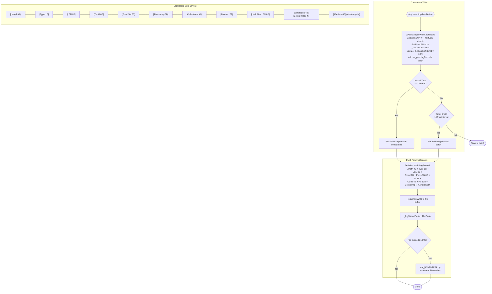
```mermaid
flowchart TB
    subgraph tx[Transaction Write]
        OP([Any Insert/Update/Delete])
        LOG[WALManager.WriteLogRecord\nAssign LSN = ++_nextLSN atomic\nSet PrevLSN from _txnLastLSN txnId\nUpdate _txnLastLSN txnId = LSN\nAdd to _pendingRecords batch]
        COMMIT_Q{record.Type\n== Commit?}
        FORCE[FlushPendingRecords immediately]
        TIMER_Q{Timer fired?\n100ms interval}
        BATCH[FlushPendingRecords batch]
    end

    subgraph flush[FlushPendingRecords]
        SER_ALL[Serialize each LogRecord:\n Length 4B + Type 1B + LSN 8B +\n TxnId 8B + PrevLSN 8B + Ts 8B +\n CollId 4B + Ptr 13B + BeforeImg N + AfterImg M]
        WRITE[_logWriter.Write to file buffer]
        FSYNC[_logWriter.Flush + file.Flush]
        ROTATE{File exceeds 10MB?}
        NEW_FILE[wal_NNNNNNNN.log\nincrement file number]
    end

    OP --> LOG --> COMMIT_Q
    COMMIT_Q -->|Yes| FORCE --> SER_ALL
    COMMIT_Q -->|No| TIMER_Q
    TIMER_Q -->|Yes| BATCH --> SER_ALL
    TIMER_Q -->|No| WAIT([Stays in batch])
    SER_ALL --> WRITE --> FSYNC --> ROTATE
    ROTATE -->|Yes| NEW_FILE
    ROTATE -->|No| DONE_W([Done])
    NEW_FILE --> DONE_W

    subgraph layout[LogRecord Wire Layout]
        direction LR
        F1["[Length 4B]"]
        F2["[Type 1B]"]
        F3["[LSN 8B]"]
        F4["[TxnId 8B]"]
        F5["[PrevLSN 8B]"]
        F6["[Timestamp 8B]"]
        F7["[CollectionId 4B]"]
        F8["[Pointer 13B]"]
        F9["[UndoNextLSN 8B]"]
        F10["[BeforeLen 4B][BeforeImage N]"]
        F11["[AfterLen 4B][AfterImage M]"]
        F1 --- F2 --- F3 --- F4 --- F5 --- F6 --- F7 --- F8 --- F9 --- F10 --- F11
    end
```

---

## 18. WAL Recovery — LSN Chain & Three Phases

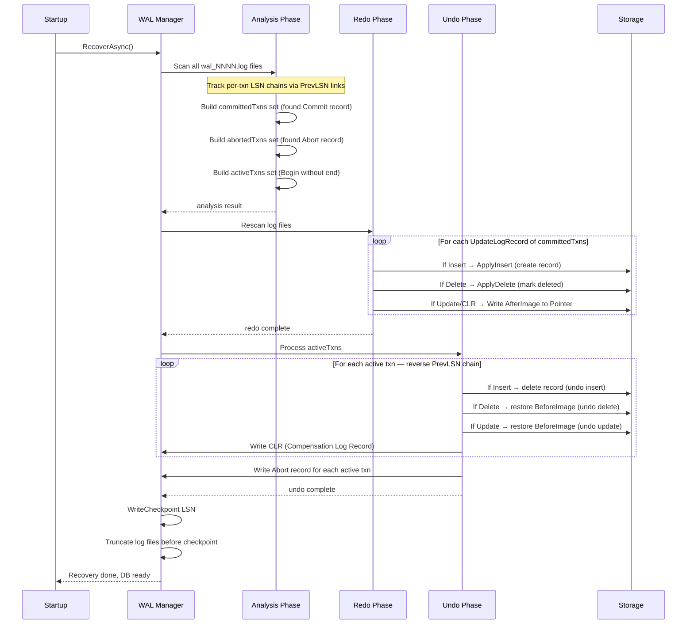
```mermaid
sequenceDiagram
    participant STARTUP as Startup
    participant WAL as WAL Manager
    participant ANAL as Analysis Phase
    participant REDO as Redo Phase
    participant UNDO as Undo Phase
    participant STOR as Storage

    STARTUP->>WAL: RecoverAsync()
    WAL->>ANAL: Scan all wal_NNNN.log files
    Note over ANAL: Track per-txn LSN chains via PrevLSN links
    ANAL->>ANAL: Build committedTxns set (found Commit record)
    ANAL->>ANAL: Build abortedTxns set (found Abort record)
    ANAL->>ANAL: Build activeTxns set (Begin without end)
    ANAL-->>WAL: analysis result

    WAL->>REDO: Rescan log files
    loop For each UpdateLogRecord of committedTxns
        REDO->>STOR: If Insert → ApplyInsert (create record)
        REDO->>STOR: If Delete → ApplyDelete (mark deleted)
        REDO->>STOR: If Update/CLR → Write AfterImage to Pointer
    end
    REDO-->>WAL: redo complete

    WAL->>UNDO: Process activeTxns
    loop For each active txn — reverse PrevLSN chain
        UNDO->>STOR: If Insert → delete record (undo insert)
        UNDO->>STOR: If Delete → restore BeforeImage (undo delete)
        UNDO->>STOR: If Update → restore BeforeImage (undo update)
        UNDO->>WAL: Write CLR (Compensation Log Record)
    end
    UNDO->>WAL: Write Abort record for each active txn
    UNDO-->>WAL: undo complete

    WAL->>WAL: WriteCheckpoint LSN
    WAL->>WAL: Truncate log files before checkpoint
    WAL-->>STARTUP: Recovery done, DB ready
```

---

## 19. MVCC Version Visibility — Timestamp Predicate

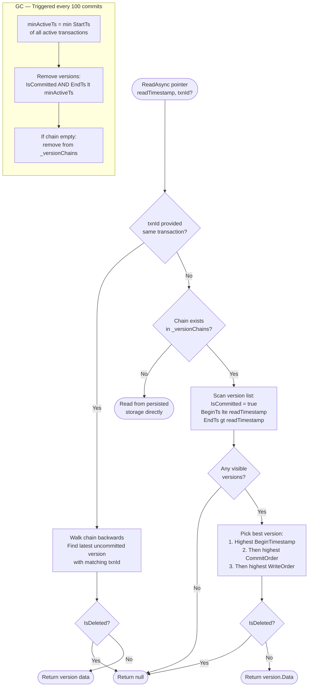
```mermaid
flowchart TD
    START([ReadAsync pointer\nreadTimestamp, txnId?]) --> SAME_TXN{txnId provided\nsame transaction?}

    SAME_TXN -->|Yes| SELF_SCAN[Walk chain backwards\nFind latest uncommitted version\nwith matching txnId]
    SELF_SCAN --> SELF_DEL{IsDeleted?}
    SELF_DEL -->|Yes| NULL_R([Return null])
    SELF_DEL -->|No| SELF_RET([Return version data])

    SAME_TXN -->|No| CHAIN{Chain exists\nin _versionChains?}

    CHAIN -->|No| STORAGE([Read from persisted\nstorage directly])

    CHAIN -->|Yes| SCAN["Scan version list:\nIsCommitted = true\nBeginTs lte readTimestamp\nEndTs gt readTimestamp"]

    SCAN --> FOUND{Any visible\nversions?}
    FOUND -->|No| NULL_R

    FOUND -->|Yes| PICK[Pick best version:\n1. Highest BeginTimestamp\n2. Then highest CommitOrder\n3. Then highest WriteOrder]

    PICK --> DEL_Q{IsDeleted?}
    DEL_Q -->|Yes| NULL_R
    DEL_Q -->|No| RET([Return version.Data])

    subgraph gc[GC — Triggered every 100 commits]
        direction TB
        MIN_TS[minActiveTs = min StartTs\nof all active transactions]
        PRUNE[Remove versions:\nIsCommitted AND EndTs lt minActiveTs]
        EMPTY[If chain empty:\nremove from _versionChains]
        MIN_TS --> PRUNE --> EMPTY
    end
```

---

## 20. Serialization Pipeline — Expression-Tree Compiler

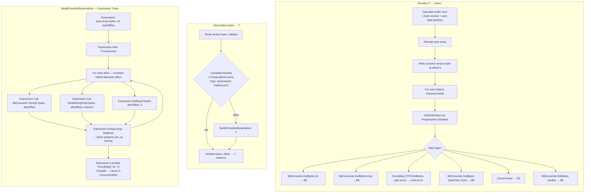
```mermaid
flowchart TD
    subgraph serialize[Serialize T → bytes]
        direction TB
        CALC[Calculate buffer size:\n1 byte version + sum field.GetSize]
        ALLOC[Allocate byte array]
        WRITE_VER[Write schema version byte at offset 0]
        FIELD_LOOP[For each field in Schema.Fields]
        GET_VAL[GetFieldValue via PropertyInfo.GetValue]
        SWITCH_W{field.Type?}
        W_INT[BitConverter.GetBytes int → 4B]
        W_LONG[BitConverter.GetBytes long → 8B]
        W_STR[Encoding.UTF8.GetBytes, pad zeros → maxLen B]
        W_DT[BitConverter.GetBytes DateTime.Ticks → 8B]
        W_BOOL[Convert bool → 1B]
        W_DBL[BitConverter.GetBytes double → 8B]

        CALC --> ALLOC --> WRITE_VER --> FIELD_LOOP
        FIELD_LOOP --> GET_VAL --> SWITCH_W
        SWITCH_W --> W_INT
        SWITCH_W --> W_LONG
        SWITCH_W --> W_STR
        SWITCH_W --> W_DT
        SWITCH_W --> W_BOOL
        SWITCH_W --> W_DBL
    end

    subgraph deserialize[Deserialize bytes → T]
        direction TB
        READ_VER[Read version byte, validate]
        CACHE_Q{Compiled lambda\nin DeserializerCache\nType, SchemaVer, FieldCount?}
        BUILD[BuildCompiledDeserializer T]
        INVOKE[lambda bytes, offset → T instance]

        READ_VER --> CACHE_Q
        CACHE_Q -->|Hit| INVOKE
        CACHE_Q -->|Miss| BUILD --> INVOKE
    end

    subgraph compile[BuildCompiledDeserializer — Expression Trees]
        direction TB
        PARAMS["Parameters:\nbyte-array bytes, int startOffset"]
        NEW_INST[Expression.New T.Constructor]
        F_LOOP[For each field — constant-folded absolute offset]
        EXPR_INT[Expression.Call BitConverter.ToInt32 bytes, absOffset]
        EXPR_STR[Expression.Call ReadStringField bytes, absOffset, maxLen]
        EXPR_BOOL[Expression.NotEqual bytes-absOffset, 0]
        ASSIGN[Expression.Assign prop, fieldExpr\n→ direct property set, no boxing]
        LAMBDA["Expression.Lambda Func(byte[], int, T)\n.Compile → cache in ConcurrentDict"]

        PARAMS --> NEW_INST --> F_LOOP
        F_LOOP --> EXPR_INT
        F_LOOP --> EXPR_STR
        F_LOOP --> EXPR_BOOL
        EXPR_INT --> ASSIGN
        EXPR_STR --> ASSIGN
        EXPR_BOOL --> ASSIGN
        ASSIGN --> F_LOOP
        ASSIGN --> LAMBDA
    end
```

---

## 21. Secondary Index Sync — Insert / Update / Delete

```mermaid
sequenceDiagram
    participant CM as CollectionManager
    participant LM as Lock Manager
    participant PM as Primary B+Tree
    participant SM as Secondary B+Trees
    participant VM as Version Manager
    participant TXN as Transaction Rollback

    Note over CM,TXN: INSERT path
    CM->>LM: AcquireRangeWriteLock(primaryKey)
    CM->>VM: WriteAsync(payload) → pointer
    CM->>PM: PutAsync(primaryKey, pointer)
    loop each secondary index
        CM->>SM: PutAsync(secondaryKey, pointer)
    end
    CM->>TXN: RegisterRollbackAction → remove all secondary entries

    Note over CM,TXN: UPDATE path
    CM->>VM: ReadAsync(pointer) → oldRecord
    CM->>VM: WriteAsync(newPayload) → newPointer
    CM->>PM: PutAsync(primaryKey, newPointer)
    loop each secondary index
        CM->>SM: RemoveAsync(oldSecondaryKey)
        CM->>SM: PutAsync(newSecondaryKey, newPointer)
    end

    Note over CM,TXN: DELETE path
    CM->>PM: RemoveAsync(primaryKey)
    loop each secondary index
        CM->>SM: RemoveAsync(secondaryKey)
    end
    CM->>VM: MarkDeleted(pointer)

    Note over CM,TXN: QUERY by secondary index
    CM->>SM: GetAsync(secondaryKey) → pointer
    CM->>VM: ReadAsync(pointer, snapshotTs)
    CM->>CM: Deserialize → T record
```

---

## 22. Auto-Increment Block Allocation

```mermaid
flowchart TD
    START([GetNextSequenceValueAsync\ncollectionId, fieldName]) --> LOCK[Acquire _sequenceLock]

    LOCK --> INIT{Key in\n_inMemoryCounters?}
    INIT -->|No| LOAD[Load from header:\nnext = SequenceCounters field + 1\n_inMemoryCounters key = next]
    INIT -->|Yes| INCREMENT

    LOAD --> INCREMENT[next = _inMemoryCounters key ++]
    INCREMENT --> RESERVED[diskReserved = SequenceCounters field]
    RESERVED --> FLUSH_Q{next exceeds diskReserved?}

    FLUSH_Q -->|No — fast path| RELEASE[Release lock\nReturn next]
    FLUSH_Q -->|Yes — block exhausted| RESERVE[Reserve new block:\nSequenceCounters field =\nnext + BlockSize 100 - 1]
    RESERVE --> SAVE[SaveHeader → db_header.json\nasync file write]
    SAVE --> RELEASE

    subgraph crash[Crash Recovery — Sequence Gaps]
        direction TB
        CR1["On crash at insert 175 of block 101-200"]
        CR2["SequenceCounters on disk = 200"]
        CR3["On restart: next alloc = 201\nGap: IDs 176–200 unused (max 99 gap)"]
        CR1 --> CR2 --> CR3
    end

    subgraph apply[ApplyAutoIncrementAsync]
        direction TB
        A1[Get autoIncrement fields from Schema]
        A2[For each field:\nGetNextSequenceValueAsync]
        A3[Set property on record object\nbefore insert]
        A1 --> A2 --> A3
    end
```

---

## 23. Page Manager & Buffer Pool — LRU Eviction

```mermaid
flowchart TD
    subgraph load[LoadPageAsync collectionId, pagePosition]
        direction TB
        L1{In _pageCache\nLRU?}
        L2{In _activePages\ncollectionId, pageNum?}
        L3[GetHandle from file pool\nRandomAccess.ReadAsync\nat pagePosition offset]
        L4[Parse Page from bytes:\nRead 12-byte header\nParse DBObjects]
        L5[Store in _activePages\nPut in _pageCache]

        L1 -->|Hit| L_RET([Return Page])
        L1 -->|Miss| L2
        L2 -->|Hit| L_RET
        L2 -->|Miss| L3 --> L4 --> L5 --> L_RET
    end

    subgraph alloc[AllocatePageAsync collectionId]
        direction TB
        A1{FreePages\navailable?}
        A2[Pop from _freePages\ncollectionId]
        A3[LoadPageAsync\nArray.Clear buffer\nMark modified]
        A4[Get nextPosition from\n_nextPagePositions collectionId]
        A5[If zero: start at _pageSize\nskip page-0 header]
        A6[Create new Page\npageNumber, _pageSize, collectionId]
        A7[Store in _activePages\n_nextPagePositions += _pageSize]

        A1 -->|Yes| A2 --> A3
        A1 -->|No| A4 --> A5 --> A6 --> A7
    end

    subgraph lru[LruCache — Eviction Policy]
        direction LR
        LRU_GET[Get key:\nFind in _dict\nMove node to list head\nReturn value]
        LRU_PUT[Put key,value:\nIf exists → remove old node\nIf full → remove list tail LRU victim, delete from _dict\nInsert new node at list head\nAdd to _dict]
        LRU_GET -.->|most recently used = head| LRU_PUT
    end

    subgraph write[WritePageAsync]
        direction TB
        W1[GetHandle for data file]
        W2[Seek to pageNum × _pageSize]
        W3[FileStream.WriteAsync page.Data]
        W4{_syncOnWrite?}
        W5[FlushAsync fsync]
        W6[page.ClearModified\nPut in _pageCache]

        W1 --> W2 --> W3 --> W4
        W4 -->|Yes| W5 --> W6
        W4 -->|No| W6
    end
```

---

## 24. File Layout on Disk

```mermaid
flowchart TB
    subgraph fs[Filesystem Layout — basePath/]
        direction TB
        HDR["db_header.json\nJSON: Version, NextCollectionId,\nCollections schema, SequenceCounters"]

        subgraph data[Data Files]
            DB1["data_1.db\nCollection 1 pages"]
            DB2["data_2.db\nCollection 2 pages"]
            DBN["data_N.db\nCollection N pages"]
        end

        subgraph idx[Index Files]
            IDX1["idx_1_0.idx\nIndex 1, partition 0 B+Tree nodes"]
            IDX2["idx_1_1.idx\nIndex 1, partition 1 B+Tree nodes"]
            IDXN["idx_M_P.idx\nIndex M, partition P"]
        end

        subgraph wal[WAL Directory — wal/]
            WAL0["wal_00000000.log"]
            WAL1["wal_00000001.log"]
            WALN["wal_NNNNNNNN.log\n10MB max, then rotate"]
        end
    end

    subgraph page_layout[.db File — Page Layout]
        direction LR
        PH["Page Header 12B:\nPageNumber 4B\nUsedSpace 4B\nCollectionId 4B"]
        OBJ1["DBObject:\nAlive 1B | SchemeId 4B\nVersion 4B | DataSize 4B\nData N bytes"]
        OBJ2["DBObject ..."]
        OBJM["DBObject ..."]
        PH --- OBJ1 --- OBJ2 --- OBJM
    end

    subgraph ptr_calc[Pointer → File Offset]
        direction TB
        PC1["Pointer.Position = pageNum × pageSize + objectOffset"]
        PC2["Pointer.Chunk = CollectionId"]
        PC3["Pointer.Type = 0x01 Data, 0x02 Node"]
        PC1 --- PC2 --- PC3
    end

    subgraph wal_layout[.log File — Record Layout]
        direction LR
        WL1["Length 4B"]
        WL2["Type 1B"]
        WL3["LSN 8B"]
        WL4["TxnId 8B"]
        WL5["PrevLSN 8B"]
        WL6["Timestamp 8B"]
        WL7["CollectionId 4B"]
        WL8["Pointer 13B"]
        WL9["BeforeImage N"]
        WL10["AfterImage M"]
        WL1 --- WL2 --- WL3 --- WL4 --- WL5 --- WL6 --- WL7 --- WL8 --- WL9 --- WL10
    end
```

---

## 25. Range Scan / Query Path

```mermaid
sequenceDiagram
    participant App as Host Application
    participant CM as CollectionManager
    participant IDX as B+Tree (Primary/Secondary)
    participant VM as Version Manager
    participant PAGE as Page Manager
    participant SER as Serializer

    App->>CM: QueryAsync(QuerySpec min, max) or ScanAsync()
    CM->>IDX: RangeAsync(minKey, maxKey)

    Note over IDX: B+Tree leaf traversal
    IDX->>IDX: SearchOperation.FindLeaf(minKey)
    IDX->>IDX: Walk leaf chain via NextLeaf pointers

    loop For each leaf key in [min, max]
        IDX-->>CM: yield (key, pointer) via IAsyncEnumerable
        CM->>VM: ReadAsync(pointer, snapshotTs, txnId)
        alt version visible
            VM-->>CM: resolved Pointer
            CM->>PAGE: LoadPageAsync(pointer)
            PAGE-->>CM: DBObject
            CM->>SER: Deserialize(RawData, offset)
            SER-->>CM: T record
            CM-->>App: yield T record
        else version not visible (filtered by MVCC)
            CM->>CM: skip record
        end
    end

    Note over CM,App: Streaming IAsyncEnumerable — no full materialization
```

---

## 26. Online Backup Path

```mermaid
sequenceDiagram
    participant App as Host Application
    participant DB as SharpDB
    participant WAL as WAL Manager
    participant PAGE as Page Manager
    participant HDR as Header Manager
    participant BKUP as Backup Target Path

    App->>DB: BackupAsync(targetPath)
    DB->>WAL: CreateCheckpointAsync()
    WAL->>WAL: Flush all pending records
    WAL->>WAL: Write Checkpoint record with current LSN
    WAL-->>DB: checkpoint LSN

    DB->>PAGE: FlushAllDirtyPagesAsync()
    PAGE->>PAGE: Write all modified pages to .db files
    PAGE-->>DB: done

    DB->>DB: Pause new write transactions

    loop For each data file data_N.db
        DB->>BKUP: Copy file to targetPath/data_N.db
    end

    loop For each index file idx_M_P.idx
        DB->>BKUP: Copy file to targetPath/idx_M_P.idx
    end

    DB->>HDR: SaveHeader() to targetPath/db_header.json
    HDR->>BKUP: Write db_header.json

    loop For each WAL file after checkpoint LSN
        DB->>BKUP: Copy wal_NNNN.log to targetPath/wal/
    end

    DB->>DB: Resume write transactions
    DB-->>App: Backup complete at targetPath
```

---

## 27. Vacuum — Version GC & Dead Page Reclaim

```mermaid
flowchart TD
    TRIGGER([Triggered every 100 commits\nTransactionManager.TryScheduleGarbageCollection]) --> MIN_TS

    MIN_TS[Calculate minActiveTimestamp\n= min BeginTimestamp of all active transactions]

    MIN_TS --> CHAIN_LOOP[For each chain in _versionChains\nstriped lock per chain key]

    CHAIN_LOOP --> VERSION_LOOP[For each VersionedRecord in chain]
    VERSION_LOOP --> PRUNE_Q{IsCommitted AND\nEndTs lt minActiveTs?}
    PRUNE_Q -->|No — still needed| NEXT_VER[Next version]
    PRUNE_Q -->|Yes — reclaimable| PRUNE[Remove from chain list]
    PRUNE --> PHYS_Q{Was this a\nphysically stored version?}
    PHYS_Q -->|Yes| FREE_PAGE[PageManager.MarkPageFree\nAdd pointer to _freePages\nfor future reuse]
    PHYS_Q -->|No — in-memory only| NEXT_VER
    FREE_PAGE --> NEXT_VER
    NEXT_VER --> VERSION_LOOP

    VERSION_LOOP --> CHAIN_EMPTY{Chain empty?}
    CHAIN_EMPTY -->|Yes| REMOVE_CHAIN[Remove from _versionChains dict]
    CHAIN_EMPTY -->|No| CHAIN_LOOP
    REMOVE_CHAIN --> CHAIN_LOOP

    CHAIN_LOOP --> DONE([GC pass complete\nMemory and page slots reclaimed])
```

---

## 28. Full Component Class Map

```mermaid
classDiagram
    class SharpDB {
        +CreateCollectionAsync()
        +GetCollectionAsync()
        +BeginTransactionAsync()
        +CommitTransactionAsync()
        +BackupAsync()
        +VacuumAsync()
    }

    class CollectionManager {
        -Schema _schema
        -IBPlusTreeIndex _primaryIndex
        -Dictionary _secondaryIndexes
        +InsertAsync()
        +SelectAsync()
        +UpdateAsync()
        +DeleteAsync()
        +QueryAsync()
        +ScanAsync()
        +CreateSecondaryIndexAsync()
    }

    class TransactionManager {
        -LockManager _lockManager
        -VersionManager _versionManager
        -WALManager _walManager
        +BeginAsync()
        +CommitAsync()
        +RollbackAsync()
        +TryScheduleGarbageCollection()
    }

    class LockManager {
        -ConcurrentDict _locks
        -ConcurrentDict _txnLocks
        -ConcurrentDict _rangeLocks
        -DeadlockDetector _detector
        +AcquireLockAsync()
        +AcquireRangeLockAsync()
        +ReleaseAllLocksAsync()
    }

    class DeadlockDetector {
        -Dictionary _waitForGraph
        +AddWait()
        +RemoveWait()
        -DFS()
    }

    class VersionManager {
        -ConcurrentDict _versionChains
        -long _currentTimestamp
        +WriteAsync()
        +ReadAsync()
        +CommitAsync()
        +GarbageCollectAsync()
    }

    class WALManager {
        -List _pendingRecords
        -Timer _flushTimer
        -long _nextLSN
        +WriteLogRecord()
        +FlushPendingRecords()
        +RecoverAsync()
        +CreateCheckpointAsync()
    }

    class BPlusTreeIndexManager {
        -BufferedIndexIOSession _session
        -BPlusTreeMutationEngine _engine
        +GetAsync()
        +PutAsync()
        +RemoveAsync()
        +RangeAsync()
    }

    class BPlusTreeMutationEngine {
        -InsertOperation _insert
        -DeleteOperation _delete
        +MutateAsync()
        +CommitAsync()
    }

    class BufferedIndexIOSession {
        -Dictionary _dirtyCache
        -LruCache _readCache
        -long _nextTempPointer
        +ReadAsync()
        +WriteAsync()
        +FlushAsync()
    }

    class PageManager {
        -ConcurrentDict _activePages
        -LruCache _pageCache
        -ConcurrentDict _freePages
        +LoadPageAsync()
        +AllocatePageAsync()
        +WritePageAsync()
    }

    class BinaryObjectSerializer {
        -Schema _schema
        -ConcurrentDict DeserializerCache$
        +Serialize()
        +Deserialize()
        -BuildCompiledDeserializer()
    }

    class DatabaseHeaderManager {
        -Dictionary _inMemoryCounters
        +GetNextSequenceValueAsync()
        +SaveHeader()
        +LoadHeader()
    }

    SharpDB "1" --> "*" CollectionManager : manages
    SharpDB --> TransactionManager : owns
    CollectionManager --> TransactionManager : uses
    CollectionManager --> BPlusTreeIndexManager : primary + secondary
    CollectionManager --> BinaryObjectSerializer : serialize records
    TransactionManager --> LockManager : acquires locks
    TransactionManager --> VersionManager : MVCC
    TransactionManager --> WALManager : durability
    LockManager --> DeadlockDetector : detect cycles
    BPlusTreeIndexManager --> BPlusTreeMutationEngine : mutations
    BPlusTreeIndexManager --> BufferedIndexIOSession : IO
    BPlusTreeMutationEngine --> BufferedIndexIOSession : read/write nodes
    CollectionManager --> PageManager : data pages
    CollectionManager --> DatabaseHeaderManager : sequences
